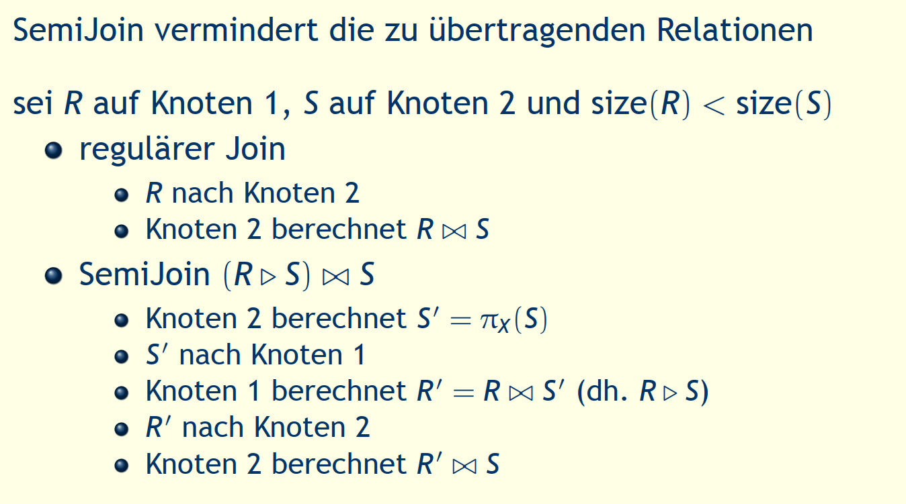

---
title: "Zusammenfassung DDM"
author: "Jurij Maïkoff"
date: "2019-06-11"
subject: "DDM"
lang: "de"
titlepage: true
titlepage-color: "06386e"
titlepage-text-color: "FFFFFF"
titlepage-rule-color: "FFFFFF"
titlepage-rule-height: 1
...
\newpage

# Sie können verteilte Datenbank systeme entlang der Dimension HEterogenität, Autonomie und Verteilung klassifizieren

- **Heterogenität**: Hardware, Netzwerkprotokolle,
Datenverwaltung, Datenmodell, Abfragesprache,
Transaktionsverwaltung
  - 2 Ausprägungen: homogen, heterogen
- **Verteilung**: betrifft die Verteilung der Daten
  - 3 Ausprägungen: zentral, client/server, verteilt
- **Autonomie**: betrifft die Verteilung der Steuerung
  - 3 Ausprägungen: stark integriert, halbautonom, isoliert

# Sie kennen die 12 Regeln für verteilte Datenbanksysteme von Chris Date

1. Lokale Autonomie
2. Unabhängigkeit von zentralen Systemfunktionen
3. Hohe Verfügbarkeit
4. Ortstransparenz
5. Fragmentierungstransparenz
6. Replikationstransparenz
7. Verteilte Anfragebearbeitung
8. Verteilte Transaktionsverarbeitung
9. Hardware Unabhängigkeit
10. Betriebssystem Unabhängigkeit
11. Netzwerkunabhängigkeit
12. Datenbanksystem Unabhängigkeit

# Sie können den Begriff Transparenz in verteilten Datenbanken erklären.

- **Ortstransparenz** (Positionstransparenz) Der Ort, an dem sich ein Dienst oder eine Ressource befindet ist dem Benutzer nicht bekannt. Der Zugriff erfolgt über einen bestimmten Namen, der allerdings keine Ortsinformationen enthält.
- **Zugriffstransparenz** Der Zugriff auf die Ressource erfolgt immer auf die gleiche Art und Weise, egal ob diese sich lokal oder entfernt im Netz befindet.

# Sie können mit mindestens 2 verschiedenen Methoden Ortstransparenz mit einer verteilten Oracle Datenbank realisieren.

- **Replikationstransparenz** Aus Performancegründen kann es mehrere Kopien derselben Ressource geben. Das System sorgt für die transparente Replikation der darin vorgenommenen Änderungen.
- **Fragmentierungstransparenz** Die Teilbestandteile einer Ressource können an verschiedenen Orten gespeichert sein.
\newline 

``` SQL
-- Ortstransparenz
-- wird benötigt, dass bei select statement nicht immer der ganze link angezeigt werden muss
-- so muss der benutzer nicht wissen wo die daten genau liegen, höchstens dass sie an einem anderen ort liegen
CREATE OR REPLACE VIEW filme
AS SELECT * FROM filme@ganymed.sirius.fhnw.ch;
DROP VIEW filme;

-- Namenstransparenz
CREATE SYNONYM filme FOR filme@ganymed.sirius.fhnw.ch;

--link zu anderem Datenbankserver
CREATE DATABASE LINK ganymed.sirius.fhnw.ch
CONNECT TO ddm61 IDENTIFIED BY ddm61
USING 'ganymed';
```


# Sie können das Entwurfsproblem für verteilte Datenbanken erläutern und kennen 2 Entwurfsstrategien.

- Entscheid über die Platzierung von Daten auf den Knoten eines Computernetzwerks
- beeinfusst die Performance der DDB und der Anwendungen
- lokaler Zugriff ist günstiger als Zugriff auf entfernte Knoten
- Analyse:
  - welche Anwendungen (Queries)
  - auf welchen Knoten
  - benötigen welche Daten
  - mit welcher Häufgkeit
- Resultat:
  - Menge von Fragmenten (Ausschnitte der Daten)
  - zugeteilt auf verschiedene Knoten


# Sie können eine primäre horizontale Fragmentierung durchführen.


# Sie können eine vertikale Fragmentierung durchführen.


# Sie kennen die Korrektheitsregeln für eine Fragmentierung und können sie auf ein Beispiel anwenden.

- **vollständigkeit**
  - wenn R zerlegt wird in R1, R2, . . . , Rn, dann muss jedes Datenelement
aus R in einem Ri enthalten sein.
- **rekonstruierbar**
  - wenn R zerlegt wird in R1, R2, . . . , Rn, dann muss es relationale
Operatoren geben, so dass R wiederhergestellt werden kann.
- **disjunkt**
  - wenn R horizontal zerlegt wird in R1, R2, . . . , Rn, dann müssen die
Fragmente paarweise disjunkt sein.
wenn R vertikal zerlegt wird in R1, R2, . . . , Rn, dann müssen die
Fragmente bezogen auf die nichtprimen Attribute paarweise
disjunkt sein.

# Sie können die verschiedenen Phasen einer verteilten Anfrageverarbeitung beschreiben.


## Zerlegung

SQL Query zerlegen und umformen in relationale Algebra unter
Verwendung des globalen Schemas
- Normalisierung (Bedingung in WHERE Klausel)
- Analyse, um inkorrekte Queries zurückzuweisen
  - Analyse nach Typ
  - Analyse nach Semantik
- Vereinfachung, Redundanz beseitigen
- Umformen in optimalen Ausdruck der relationalen Algebra

## Lokalisierung
- verwenden des Fragmentierungsschema
- Verteilte Anfrage mit globalen Relationen abbilden in Anfragen
mit Fragmenten
  - Ersetzen der globalen Relation mit den Fragmenten
  - U für horizontale Fragmentierung
  - (kravatten-symbol) für vertikale Fragmentierung
- Optimieren der lokalisierten Anfrage durch Reduktion
  - Reduktion mit Selektion
  - Reduktion mit Join

## Globale Optimierung

fnde den besten globalen Ausführungsplan
- Kostenfunktion minimieren
- verteilte Join Verarbeitung
  - Bushy versus Left Deep (Linear) Tree
  - Welche Relation wohin transferieren
  - Vollständig oder nach Bedarf transferieren
- Einsatz des SemiJoins
  - Übertragungskosten sparen aber mehr lokale Verarbeitung
- Join Methoden
  - Nested Loop versus Hash Join versus ...

## Lokale Optimierung

Aus der globalen Optimierung steht der beste globale
Ausführungsplan zur Verfügung
Jeder Knoten muss für sich
- den besten Zugriffspfad bestimmen
- Optimierungstechniken verwenden wie in zentralisierten
Systemen

# Sie können eine globale Anfrage in eine lokalisierte und reduzierte Anfrage überführen.


# Sie verstehen den Begriff Collocated Inline View und können ihn anhand eines Beispiels erklären.

- Ziel ist es, auf einen entfernten Knoten so wenig wie möglich zuzugreifen und nur die nötigen Daten zu verlangen. Mit Hilfe der Collocated Inline Views wird dafür gesorgt, dass auf einen entfernten Knoten nur einmal zugegriffen wird.
  - Collocated: Zwei oder mehr Tabellen sind auf dem gleichen Knoten
  - Inline View: Ein Subquery anstelle einer Tabelle in der FROM-Klausel
  - Collocated Inline View: Das sind Inline Views, die nur auf Tabellen einer einzigen Datenbank zugreifen

# Sie kennen den Semijoin und können anhand eines Beispiels erklären, wie damit die Performance eines Joins in einer verteilten Datenbank verbessert werden kann.





# Sie kennen die Aspekte der Transaktionsverarbeitung in verteilten Datenbanksystemen.

- Transaktionsstruktur (Transaktionsmodell)
  - fache Transaktion, verschachtelte Transaktion
- Konsistenzerhaltung der Datenbank
- Zuverlässigkeitsprotokolle
  - Unteilbarkeit, Dauerhaftigkeit
  - lokale Wiederherstellung
  - globale Commit Protokolle
- Nebenläufgkeitskontrolle
  - Ausführung nebenläufger Transaktionen (Korrektheit?)
  - Konsistenzerhaltung zwischen Transaktionen, Isolation
- Kontrolle der Replikate
  - Kontrolle der gegenseitigen Konsistenz von Replikaten
  - One-Copy Equivalence, ROWA

# Sie verstehen die Erweiterung des Begriffs Serialisierbarkeit in einem verteilten Datenbanksystem

für Serialisierbarkeit des globalen Ablaufplans sind zwei
Bedingungen nötig
- jeder lokale Ablaufplan muss serialisierbar sein
- zwei Konflikt Operationen müssen in der gleichen Reihenfolge
auftreten in allen lokalen Ablaufplänen, in denen sie zusammen
auftreten

# Sie können 3 verschiedene Varianten der Realisierung des 2-Phasen-Sperrprotokolls in verteilten Datenbanksystemen erklären.

- basierend auf 2 Phasen Sperrprotokoll
  - zentrales (primary site) 2PL
  - Primary Copy 2PL
  - verteiltes 2PL
- häufig mit Snapshot Verfahren
  - Read Consistency bei Oracle
  - verwenden der SCN als Timestamp
  - SCN Synchronisieren bei verteilten DBS

## Zentral


## Primary

- Lock Manager auf einigen Knoten verteilt jeder Lock Manager verantwortlich für die Sperren einer Menge von Daten
- bei Replikaten wird eine Kopie als Primary Copy bestimmt, die anderen sind slave copies
- Schreibsperre nur auf Primary Copy
- nach Änderung der Primary Copy, Änderungen zu den slaves
bringen
- komplexeres Deadlock Handling
- weniger Kommunikation, bessere Performance

## Verteilt


# Sie können das Problem der Erkennung von verteilten Deadlocks beschreiben.

- Transaktionen sind in einem Deadlock, wenn sie blockiert sind
und es bleiben, bis das System eingreift
- Deadlocks treten in 2PL auf zur Vermeidung nicht
serialisierbarer Ablaufpläne
- um einen Deadlock aufzulösen, muss eine Transaktion
abgebrochen werden
- in einem Wait For Graph (WFG) können Deadlocks erkannt
werden
  - WFG ist gerichteter Graph und stellt die Erwarte auf Beziehung
  - zwischen Transaktionen dar
  - Transaktionen sind die Knoten im WFG
  - Kante Ti ! Tj im WFG bedeutet, Ti wartet auf die Freigabe einer
  - Sperre von Tj
  - Zyklen im WFG zeigen Deadlocks

- Ansatz: automatisch Deadlocks erkennen und eine betroffene
Transaktion abbrechen
- bevorzugter Ansatz
  - höhere Resourcen Nutzung
  - einfache Verfahren
- Timeout: Transaktion, die zu lange blockiert ist, abbrechen
  - einfach zu realisieren
  - bricht Transaktionen unnötigerweise an
  - Deadlocks können lange bestehen

# Sie kennen die Komponenten zur Sicherstellung von Atomicity und Durability verteilter Transaktionen.

- Jeder Knoten kann
  - lokaler Teil der Transaktion zuverlässig verarbeiten
  - nach Bedarf lokales Commit durchführen
  - nach Bedarf lokales Rollback durchführen
  - nach Bedarf lokales Recovery durchführen
- Übergeordnete Protokolle müssen sich mit der Koordination der
beteiligten Knoten befassen
  - Start der Transaktion beim Ursprungsknoten verarbeiten
  - Read und Write an den Zielknoten verarbeiten
  - spezielle Vorkehrungen bei Replikation
  - Abort, Commit und Recover spezifisch für DDB

## Komponenten
- unterscheiden in
  - Coordinator Process beim Ursprungsknoten, steuert die Ausführung
  - Participant Process bei den anderen Knoten, die an der Transaktion beteiligt sind
- verschiedene Protokolle (Reliability Protocols)
  - Commit Protocols
  - Termination Protocols
  - Recovery Protocols

# Sie können das 2-Phasen-Commit Protokoll beschreiben und kennen 3 verschiedene Kommunikationsvarianten.


# Sie können die 2 Hauptprobleme des 2PC Protokolls erläutern.

- Blockierend
  - Im Zustand READY muss Teilnehmer auf Entscheid des Koordinators warten.
  - Fällt Koordinator aus, ist Teilnehmer blockiert.
  - Damit wird Verfügbarkeit reduziert.
- Unabhängiges Recovery nicht möglich
  - Recovery eines Teilnehmers nach Ausfall im Zustand READY kann
nicht unabhängig erfolgen.
  - Verfügbarkeit des Koordinators oder eines Teilnehmers, der die
Rolle des Koordinators übernimmt ist nötig.

# Sie kennen die Vor- und Nachteile von replizierten Daten.

- Gründe für Replikation
  - Zuverlässigkeit
    - vermeidet single points of failure
  - Performance
    - vermeidet Kommunikationskosten (lokaler Zugriff)
  - Skalierbarkeit
    - unterstützt Wachstum des Systems
  - Anforderungen durch Anwendungen
    - Spezifikation
- Probleme mit Replikation
  - Transparenz der Replikation
    - Abbilden logischer Zugriff in physische Zugriffe auf Kopien
  - Fragen der Konsistenz
    - Konsistenzkriterien
    - Synchronisierung der Kopien

# Sie kennen verschiedenen Konsistenzmodelle für die Replikation.

## Strong Consistency

One-Copy Equivalence
- gegenseitige Konsistenz wenn alle Kopien identische Werte haben
- Wirkung einer Transaktion auf replizierte Daten ist die gleiche,
wie wenn sie auf einer einzelnen Datenmenge operierte.

One-Copy Serializability
- Wirkung von Transaktionen auf replizierte Daten ist die gleiche,
wie wenn sie eine nach der anderen auf einer einzelnen Datenmenge operierten.
- Histories sind äquivalent zu einer seriellen Ausführung auf nicht
replizierten Daten

## Weak Consistency

- Abgeschwächte Formen der Konsistenz
- Eventual Consistency: Konsistenz wird letztendlich (später)
erreicht
- Wenn weitere Updates ausbleiben, konvergieren die Replikate
zu identischen Kopien.
- Nur die Ausbreitung der Updates muss garantiert sein
- Kein Problem, solange die Nutzer immer auf das gleiche
Replikat zugreifen.
  - Übergang zu Client-Centric Consistency
  - Garantiert einem einzelnen Nutzer konsistenten Zugriff auf Daten

## Client-Centric Consistency

**Monotonic Reads (gleichbleibend)**
- Liest ein Prozess Datenelement x, dann gibt jedes nachfolgende
Lesen von x durch diesen Prozess denselben oder neueren Wert
zurück
**Monotonic Writes**
- Schreiboperation auf Datenelement x ist abgeschlossen, bevor
derselbe Prozess nachfolgende Schreiboperationen auf x ausführt
(Serialisierung des Schreibens)
**Read your Writes**
- Die Wirkung von Schreiboperation auf Datenelement x wird immer
in nachfolgenden Leseoperationen auf x durch denselben Prozesse
gesehen
**Writes follow Reads**
- Schreiboperationen auf Datenelement x, die auf ein Lesen durch
denselben Prozess folgen, überschreiben immer denselben oder
neueren Wert von x

# Sie können die verschiedenen Update Propagation Strategien beschreiben.

Zeitpunkt der Update Propagation
- Eager (Synchronous)
- Lazy (Asynchronous)
Ort des Updates
- Primary Copy (Master)
- Update everywhere (Group)

## Eager / Lazy Replication

**Eager (Synchronous) Replication**
- Jede Änderung wird sofort zu allen Kopien übertragen
- Übertragung der Änderungen erfolgt innerhalb der Grenzen der
Transaktion.
- ACID Eigenschaften gelten für alle Kopien
**Lazy (Asynchronous) Replication**
- Zuerst werden die lokalen Kopien geändert. Anschliessend werden
die Änderungen zu allen anderen Kopien übertagen (push/pull).
- Während der Übertragung sind Kopien inkonsistent
- Zeitraum der Inkonsistenz kann in Abhängigkeit der Anwendung
angepasst werden

## Master / Group Replication

**Master (Primary Copy) Replication**
- Es gibt eine einzige Kopie, auf der Änderungen ausgeführt werden
können (Master)
- Alle anderen Kopien (Slaves) übernehmen die Änderungen vom
Master
- für verschiedene Datenelemente können verschiedene Knoten
Master sein
**Group (Update everywhere) Replication**
- Änderungen können auf jeder Kopie ausgeführt werden.
- D.h. jeder Knoten, der eine Kopie besitz, kann auf ihr Änderungen
ausführen.

## Eager Master (Synchronous Primary Copy) Replication

**Primary Copy**
- Read: lokales Lesen (eigene Kopie), Resultat zurückgeben
- Write: lokales Schreiben, Write an alle Slaves weiterleiten (in
FIFO Reihenfolge oder mit Timestamps), Kontrolle sofort dem
Nutzer zurückgeben
- Commit: verwende 2PC als Koordinator
- Abort: lokales Abort, Slaves informieren
**Slave**
- Read: lokales Lesen (eigene Kopie), Resultat zurückgeben
- Write von Master: ausführen der Writes in richtiger Reihenfolge
(FIFO oder Timestamp)
- Write von Client: zurückweisen oder an Master weiterleiten
- ist Teilnehmer am 2PC der Transaktionen vom Master


**Vorteile**
- Änderungen müssen nicht koordiniert werden
- Keine Inkonsistenzen
**Nachteile**
- Längste Antwortzeit
- Nur bei wenigen Updates sinnvoll (Master ist Flaschenhals)
- Lokale Kopien sind beinahe nutzlos
- selten eingesetzt

## Eager Group (Synchronous Update Everywhere) Replication

Read One Write All (ROWA)
- jeder Knoten verwendet 2 Phasen Sperrprotokoll
- Leseoperationen werden lokal durchgeführt
- Schreiboperationen werden auf allen Knoten ausgeführt mithilfe
eines verteilten Sperrprotokolls


**Vorteile**
- Keine Inkonsistenzen
- elegante Lösung (symmetrisch)
**Nachteile**
- Vielzahl von Nachrichten
- Antwortzeiten der Transaktionen sind sehr lang
- beschränkte Skalierbarkeit (Deadlock Wahrscheinlichkeit wächst
mit Anzahl Knoten)

## Lazy Master (Asynchronous Primary Copy)

**Primary Copy**
- Read: lokales Lesen (eigene Kopie), Resultat zurückgeben
- Write: lokales Schreiben Kontrolle dem Nutzer zurückgeben
- Commit, Abort: Transaktion lokal beenden
- Irgendwann nach dem Commit: an alle Knoten die Änderungen in
einer einzigen Nachricht übermitteln (FIFO oder Timestamp
Reihenfolge)
**Slave**
- Read: lokales Lesen (eigene Kopie), Resultat zurückgeben
- Nachricht von Master: Änderungen in richtiger Reihenfolge (FIFO
oder Timestamp) anwenden
- Write von Client: zurückweisen oder an Master weiterleiten
- Commit, Abort: nur für lokale Read-only Transaktionen


**Vorteile**
- Keine Koordination nötig
- kurze Antwortzeiten (Transaktionen sind lokal)
*Nachteile*
- lokale Kopien sind nicht aktuell
- Inkonsistenzen (verschiedene Knoten haben unterschiedliche
Werte für das gleiche Datenelement)

## Lazy Group (Asynchronous Update Everywhere) Replication

jeder Knoten
- Read: lokales Lesen (eigene Kopie), Resultat zurückgeben
- Write: lokales Schreiben Kontrolle dem Nutzer zurückgeben
- Commit, Abort: Transaktion lokal beenden
- Irgendwann nach dem Commit: an alle Knoten die Änderungen in
einer einzigen Nachricht übermitteln (FIFO oder Timestamp
Reihenfolge)
- Nachricht von anderem Knoten:
  - Erkennen von Konflikten
  - Änderungen anwenden
  - Reconciliation (Abgleichen)


**Vorteile**
- Keine Koordination nötig
- kürzeste Antwortzeiten
**Nachteile**
- Inkonsistenzen
- Änderungen könne verloren gehen (Abgleich)

# Sie können erläutern, wie in Oracle 12c Replikation mit Materialized Views realisiert wird und welcher Replikations Strategie dies entspricht.

# Sie kennen die Kategorisierung der NoSQL Systeme mit den typischen Vertretern.

# Sie können das CAP-Theorem erläutern.

# Sie kennen das Map/Reduce Verfahren und können dafür typische Anwendungen programmieren.

# Sie kennen die Modellierungsprinzipen für Cassandra und können diese anwenden.

# Sie können mit CQL Datendefinitionen realisieren und Anfragen formulieren.

# Sie können Datenmodelle für MongoDB entwerfen und kennen die verschiedenen Dartellungsmöglichkeiten von Beziehungen.

# Sie können mit der Mongo Shell Datendefinitionen realisieren und Anfragen formulieren.

# Sie kennen das Graphdatenmodell von Neo4j.

# Sie können mit der Sprache Cypher Datendefinitionen realisieren und Anfragen formulieren.

# Sie können das Datenmodell des Resource Description Frameworks anhand eines Beispiels erläutern.