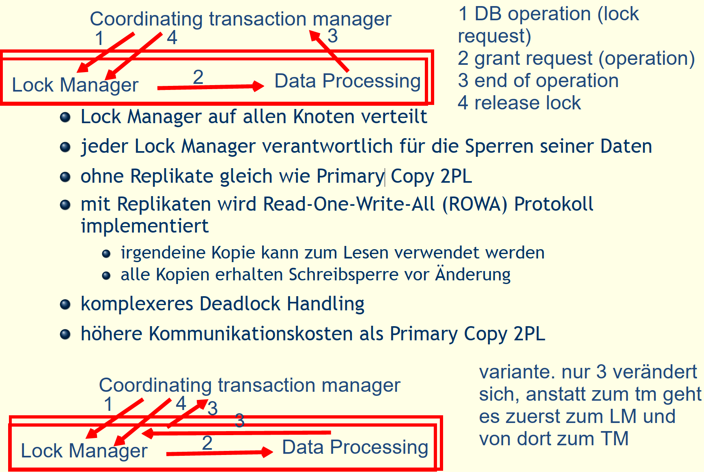
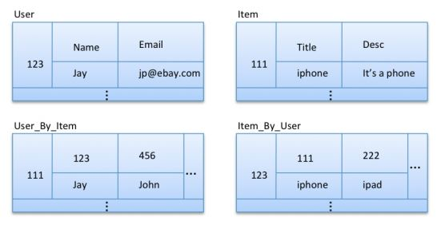

---
title: "Zusammenfassung DDM"
author: "Jurij Maïkoff"
date: "2019-06-11"
subject: "DDM"
lang: "de"
titlepage: true
titlepage-color: "06386e"
titlepage-text-color: "FFFFFF"
titlepage-rule-color: "FFFFFF"
titlepage-rule-height: 1
...
\newpage

# Sie können verteilte Datenbank systeme entlang der Dimension HEterogenität, Autonomie und Verteilung klassifizieren

- **Heterogenität**: Hardware, Netzwerkprotokolle,
Datenverwaltung, Datenmodell, Abfragesprache,
Transaktionsverwaltung
  - 2 Ausprägungen: homogen, heterogen
- **Verteilung**: betrifft die Verteilung der Daten
  - 3 Ausprägungen: zentral, client/server, verteilt
- **Autonomie**: betrifft die Verteilung der Steuerung
  - 3 Ausprägungen: stark integriert, halbautonom, isoliert

# Sie kennen die 12 Regeln für verteilte Datenbanksysteme von Chris Date

1. Lokale Autonomie
2. Unabhängigkeit von zentralen Systemfunktionen
3. Hohe Verfügbarkeit
4. Ortstransparenz
5. Fragmentierungstransparenz
6. Replikationstransparenz
7. Verteilte Anfragebearbeitung
8. Verteilte Transaktionsverarbeitung
9. Hardware Unabhängigkeit
10. Betriebssystem Unabhängigkeit
11. Netzwerkunabhängigkeit
12. Datenbanksystem Unabhängigkeit

# Sie können den Begriff Transparenz in verteilten Datenbanken erklären.

- **Ortstransparenz** (Positionstransparenz) Der Ort, an dem sich ein Dienst oder eine Ressource befindet ist dem Benutzer nicht bekannt. Der Zugriff erfolgt über einen bestimmten Namen, der allerdings keine Ortsinformationen enthält.
- **Zugriffstransparenz** Der Zugriff auf die Ressource erfolgt immer auf die gleiche Art und Weise, egal ob diese sich lokal oder entfernt im Netz befindet.

# Sie können mit mindestens 2 verschiedenen Methoden Ortstransparenz mit einer verteilten Oracle Datenbank realisieren.

- **Replikationstransparenz** Aus Performancegründen kann es mehrere Kopien derselben Ressource geben. Das System sorgt für die transparente Replikation der darin vorgenommenen Änderungen.
- **Fragmentierungstransparenz** Die Teilbestandteile einer Ressource können an verschiedenen Orten gespeichert sein.
\newline 

``` SQL
-- Ortstransparenz
-- wird benötigt, dass bei select statement nicht immer der ganze link angezeigt werden muss
-- so muss der benutzer nicht wissen wo die daten genau liegen, höchstens dass sie an einem anderen ort liegen
CREATE OR REPLACE VIEW filme
AS SELECT * FROM filme@ganymed.sirius.fhnw.ch;
DROP VIEW filme;

-- Namenstransparenz
CREATE SYNONYM filme FOR filme@ganymed.sirius.fhnw.ch;

--link zu anderem Datenbankserver
CREATE DATABASE LINK ganymed.sirius.fhnw.ch
CONNECT TO ddm61 IDENTIFIED BY ddm61
USING 'ganymed';
```


# Sie können das Entwurfsproblem für verteilte Datenbanken erläutern und kennen 2 Entwurfsstrategien.

- Entscheid über die Platzierung von Daten auf den Knoten eines Computernetzwerks
- beeinfusst die Performance der DDB und der Anwendungen
- lokaler Zugriff ist günstiger als Zugriff auf entfernte Knoten
- Analyse:
  - welche Anwendungen (Queries)
  - auf welchen Knoten
  - benötigen welche Daten
  - mit welcher Häufgkeit
- Resultat:
  - Menge von Fragmenten (Ausschnitte der Daten)
  - zugeteilt auf verschiedene Knoten


# Sie können eine primäre horizontale Fragmentierung (PHF) durchführen


## Simple predicate p

Vergleich von einem Attribut mit einem Wert
- bname = 'Siena', preis < 2000

Sind bool'sche Kombinationen von simple Predicates

## Minterm predicate M(P)

Verknüpfen aller simple predicates aus P mit AND und NOT
- bname = 'Siena', AND NOT (preis <2000)

Mit den Minterms müssen alle Daten abgedeckt werden. 
- Minterm selectivity: sel(mi)
  - Anzahl Tupel die mit dem Minterm mi ausgewählt werden
- Access Frequency acc(mi)
  - Häufigketi der Anwendung auf Daten mit dem Minterm mi zugreifen

## PHF - 1. Schritt

Finden einer Menge von simple predicates die Vollständig und Minimal sind. 

## PHF - 2. Schritt 

Bilden von minterms
**Anwendung 1**
Erfragt Namen und Bestand von Bikes nach Typ: City (4/Woche),
Trekking (3/Woche), Mountain (2/Woche), Road (1/Woche) \newline
``` 
SELECT bname, bestand
FROM bike s
WHERE typ = ?
```
simple predicates:
- p1: Typ = 'Road'
- p2: Typ = 'Mountain'
- p3: Typ = 'Trekking'
- p4: Typ = 'City'

**Anwendung 2**
Verwaltet Bikes mit Preis kleiner 2000 (3/Woche), die restlichen
Bikes (1/Woche):\newline
```
SELECT ∗
FROM bike s
WHERE p r e i s ?
```
simple predicates:
- p5: Preis < 2000
- p6: Preis >= 2000

Aus diesen 6 simple predicates könnten 2^6 = 64 minterm predicates gebildet werden.
Nur die sinnvollen verwenden, diese definieren dann die Fragmente:
- BIKES1: σTyp = 'Road' AND Preis 6 2000 (BIKES)
- BIKES2: σTyp = 'Road' AND Preis > 2000 (BIKES)
- BIKES3: σTyp = 'Mountain' AND Preis 6 2000 (BIKES)
- BIKES4: σTyp = 'Mountain' AND Preis > 2000 (BIKES)
- BIKES5: σTyp = 'Trekking' AND Preis 6 2000 (BIKES)
- BIKES6: σTyp = 'Trekking' AND Preis > 2000 (BIKES)
- BIKES7: σTyp = 'City' AND Preis 6 2000 (BIKES)
- BIKES8: σTyp = 'City' AND Preis > 2000 (BIKES)

## Abgeleitete horizontale Fragementierung (DHF)

Eine horizontale Fragmentierung die von einer anderen Abhängig ist. Dabei wird geschaut, dass Daten die zusammen verwendet werden, auf dem selben Knoten liegen. 


# Sie können eine vertikale Fragmentierung durchführen.


Man muss auswerten welche Queries ausgeführt werden, auf welche Attribute, auf welchen Knoten und wie häufig. 
Um dann entscheiden zu können, welche Attribute werden häufig zusammen verwendet und sollten deshalb zum gleichen Fragment gehören

Für diese Folien siehe Anhang. 

# Sie kennen die Korrektheitsregeln für eine Fragmentierung und können sie auf ein Beispiel anwenden.

- **vollständigkeit**
  - wenn R zerlegt wird in R1, R2, . . . , Rn, dann muss jedes Datenelement
aus R in einem Ri enthalten sein.
- **rekonstruierbar**
  - wenn R zerlegt wird in R1, R2, . . . , Rn, dann muss es relationale
Operatoren geben, so dass R wiederhergestellt werden kann.
- **disjunkt**
  - wenn R horizontal zerlegt wird in R1, R2, . . . , Rn, dann müssen die
Fragmente paarweise disjunkt sein.
wenn R vertikal zerlegt wird in R1, R2, . . . , Rn, dann müssen die
Fragmente bezogen auf die nichtprimen Attribute paarweise
disjunkt sein.

# Sie können die verschiedenen Phasen einer verteilten Anfrageverarbeitung beschreiben.


## Zerlegung

SQL Query zerlegen und umformen in relationale Algebra unter
Verwendung des globalen Schemas
- Normalisierung (Bedingung in WHERE Klausel)
- Analyse, um inkorrekte Queries zurückzuweisen
  - Analyse nach Typ
  - Analyse nach Semantik
- Vereinfachung, Redundanz beseitigen
- Umformen in optimalen Ausdruck der relationalen Algebra

## Lokalisierung
- verwenden des Fragmentierungsschema
- Verteilte Anfrage mit globalen Relationen abbilden in Anfragen
mit Fragmenten
  - Ersetzen der globalen Relation mit den Fragmenten
  - U für horizontale Fragmentierung
  - (kravatten-symbol) für vertikale Fragmentierung
- Optimieren der lokalisierten Anfrage durch Reduktion
  - Reduktion mit Selektion
  - Reduktion mit Join

## Globale Optimierung

fnde den besten globalen Ausführungsplan
- Kostenfunktion minimieren
- verteilte Join Verarbeitung
  - Bushy versus Left Deep (Linear) Tree
  - Welche Relation wohin transferieren
  - Vollständig oder nach Bedarf transferieren
- Einsatz des SemiJoins
  - Übertragungskosten sparen aber mehr lokale Verarbeitung
- Join Methoden
  - Nested Loop versus Hash Join versus ...

## Lokale Optimierung

Aus der globalen Optimierung steht der beste globale
Ausführungsplan zur Verfügung
Jeder Knoten muss für sich
- den besten Zugriffspfad bestimmen
- Optimierungstechniken verwenden wie in zentralisierten
Systemen

# Sie können eine globale Anfrage in eine lokalisierte und reduzierte Anfrage überführen.


# Sie verstehen den Begriff Collocated Inline View und können ihn anhand eines Beispiels erklären.

- Ziel ist es, auf einen entfernten Knoten so wenig wie möglich zuzugreifen und nur die nötigen Daten zu verlangen. Mit Hilfe der Collocated Inline Views wird dafür gesorgt, dass auf einen entfernten Knoten nur einmal zugegriffen wird.
  - Collocated: Zwei oder mehr Tabellen sind auf dem gleichen Knoten
  - Inline View: Ein Subquery anstelle einer Tabelle in der FROM-Klausel
  - Collocated Inline View: Das sind Inline Views, die nur auf Tabellen einer einzigen Datenbank zugreifen

# Sie kennen den Semijoin und können anhand eines Beispiels erklären, wie damit die Performance eines Joins in einer verteilten Datenbank verbessert werden kann.


# Sie kennen die Aspekte der Transaktionsverarbeitung in verteilten Datenbanksystemen.

- Transaktionsstruktur (Transaktionsmodell)
  - fache Transaktion, verschachtelte Transaktion
- Konsistenzerhaltung der Datenbank
- Zuverlässigkeitsprotokolle
  - Unteilbarkeit, Dauerhaftigkeit
  - lokale Wiederherstellung
  - globale Commit Protokolle
- Nebenläufgkeitskontrolle
  - Ausführung nebenläufger Transaktionen (Korrektheit?)
  - Konsistenzerhaltung zwischen Transaktionen, Isolation
- Kontrolle der Replikate
  - Kontrolle der gegenseitigen Konsistenz von Replikaten
  - One-Copy Equivalence, ROWA

# Sie verstehen die Erweiterung des Begriffs Serialisierbarkeit in einem verteilten Datenbanksystem

für Serialisierbarkeit des globalen Ablaufplans sind zwei
Bedingungen nötig
- jeder lokale Ablaufplan muss serialisierbar sein
- zwei Konflikt Operationen müssen in der gleichen Reihenfolge
auftreten in allen lokalen Ablaufplänen, in denen sie zusammen
auftreten

# Sie können 3 verschiedene Varianten der Realisierung des 2-Phasen-Sperrprotokolls in verteilten Datenbanksystemen erklären.

- basierend auf 2 Phasen Sperrprotokoll
  - zentrales (primary site) 2PL
  - Primary Copy 2PL
  - verteiltes 2PL
- häufig mit Snapshot Verfahren
  - Read Consistency bei Oracle
  - verwenden der SCN als Timestamp
  - SCN Synchronisieren bei verteilten DBS

## Zentral


## Primary

- Lock Manager auf einigen Knoten verteilt jeder Lock Manager verantwortlich für die Sperren einer Menge von Daten
- bei Replikaten wird eine Kopie als Primary Copy bestimmt, die anderen sind slave copies
- Schreibsperre nur auf Primary Copy
- nach Änderung der Primary Copy, Änderungen zu den slaves
bringen
- komplexeres Deadlock Handling
- weniger Kommunikation, bessere Performance

## Verteilt



# Sie können das Problem der Erkennung von verteilten Deadlocks beschreiben.

- Transaktionen sind in einem Deadlock, wenn sie blockiert sind
und es bleiben, bis das System eingreift
- Deadlocks treten in 2PL auf zur Vermeidung nicht
serialisierbarer Ablaufpläne
- um einen Deadlock aufzulösen, muss eine Transaktion
abgebrochen werden
- in einem Wait For Graph (WFG) können Deadlocks erkannt
werden
  - WFG ist gerichteter Graph und stellt die Erwarte auf Beziehung
  - zwischen Transaktionen dar
  - Transaktionen sind die Knoten im WFG
  - Kante Ti ! Tj im WFG bedeutet, Ti wartet auf die Freigabe einer
  - Sperre von Tj
  - Zyklen im WFG zeigen Deadlocks

- Ansatz: automatisch Deadlocks erkennen und eine betroffene
Transaktion abbrechen
- bevorzugter Ansatz
  - höhere Resourcen Nutzung
  - einfache Verfahren
- Timeout: Transaktion, die zu lange blockiert ist, abbrechen
  - einfach zu realisieren
  - bricht Transaktionen unnötigerweise an
  - Deadlocks können lange bestehen

# Sie kennen die Komponenten zur Sicherstellung von Atomicity und Durability verteilter Transaktionen.

- Jeder Knoten kann
  - lokaler Teil der Transaktion zuverlässig verarbeiten
  - nach Bedarf lokales Commit durchführen
  - nach Bedarf lokales Rollback durchführen
  - nach Bedarf lokales Recovery durchführen
- Übergeordnete Protokolle müssen sich mit der Koordination der
beteiligten Knoten befassen
  - Start der Transaktion beim Ursprungsknoten verarbeiten
  - Read und Write an den Zielknoten verarbeiten
  - spezielle Vorkehrungen bei Replikation
  - Abort, Commit und Recover spezifisch für DDB

## Komponenten
- unterscheiden in
  - Coordinator Process beim Ursprungsknoten, steuert die Ausführung
  - Participant Process bei den anderen Knoten, die an der Transaktion beteiligt sind
- verschiedene Protokolle (Reliability Protocols)
  - Commit Protocols
  - Termination Protocols
  - Recovery Protocols

# Sie können das 2-Phasen-Commit Protokoll beschreiben und kennen 3 verschiedene Kommunikationsvarianten.


# Sie können die 2 Hauptprobleme des 2PC Protokolls erläutern.

- Blockierend
  - Im Zustand READY muss Teilnehmer auf Entscheid des Koordinators warten.
  - Fällt Koordinator aus, ist Teilnehmer blockiert.
  - Damit wird Verfügbarkeit reduziert.
- Unabhängiges Recovery nicht möglich
  - Recovery eines Teilnehmers nach Ausfall im Zustand READY kann
nicht unabhängig erfolgen.
  - Verfügbarkeit des Koordinators oder eines Teilnehmers, der die
Rolle des Koordinators übernimmt ist nötig.

# Sie kennen die Vor- und Nachteile von replizierten Daten.

- Gründe für Replikation
  - Zuverlässigkeit
    - vermeidet single points of failure
  - Performance
    - vermeidet Kommunikationskosten (lokaler Zugriff)
  - Skalierbarkeit
    - unterstützt Wachstum des Systems
  - Anforderungen durch Anwendungen
    - Spezifikation
- Probleme mit Replikation
  - Transparenz der Replikation
    - Abbilden logischer Zugriff in physische Zugriffe auf Kopien
  - Fragen der Konsistenz
    - Konsistenzkriterien
    - Synchronisierung der Kopien

# Sie kennen verschiedenen Konsistenzmodelle für die Replikation.

## Strong Consistency

One-Copy Equivalence
- gegenseitige Konsistenz wenn alle Kopien identische Werte haben
- Wirkung einer Transaktion auf replizierte Daten ist die gleiche,
wie wenn sie auf einer einzelnen Datenmenge operierte.

One-Copy Serializability
- Wirkung von Transaktionen auf replizierte Daten ist die gleiche,
wie wenn sie eine nach der anderen auf einer einzelnen Datenmenge operierten.
- Histories sind äquivalent zu einer seriellen Ausführung auf nicht
replizierten Daten

## Weak Consistency

- Abgeschwächte Formen der Konsistenz
- Eventual Consistency: Konsistenz wird letztendlich (später)
erreicht
- Wenn weitere Updates ausbleiben, konvergieren die Replikate
zu identischen Kopien.
- Nur die Ausbreitung der Updates muss garantiert sein
- Kein Problem, solange die Nutzer immer auf das gleiche
Replikat zugreifen.
  - Übergang zu Client-Centric Consistency
  - Garantiert einem einzelnen Nutzer konsistenten Zugriff auf Daten

## Client-Centric Consistency

**Monotonic Reads (gleichbleibend)**
- Liest ein Prozess Datenelement x, dann gibt jedes nachfolgende
Lesen von x durch diesen Prozess denselben oder neueren Wert
zurück
**Monotonic Writes**
- Schreiboperation auf Datenelement x ist abgeschlossen, bevor
derselbe Prozess nachfolgende Schreiboperationen auf x ausführt
(Serialisierung des Schreibens)
**Read your Writes**
- Die Wirkung von Schreiboperation auf Datenelement x wird immer
in nachfolgenden Leseoperationen auf x durch denselben Prozesse
gesehen
**Writes follow Reads**
- Schreiboperationen auf Datenelement x, die auf ein Lesen durch
denselben Prozess folgen, überschreiben immer denselben oder
neueren Wert von x

# Sie können die verschiedenen Update Propagation Strategien beschreiben.

Zeitpunkt der Update Propagation
- Eager (Synchronous)
- Lazy (Asynchronous)
Ort des Updates
- Primary Copy (Master)
- Update everywhere (Group)

## Eager / Lazy Replication

**Eager (Synchronous) Replication**
- Jede Änderung wird sofort zu allen Kopien übertragen
- Übertragung der Änderungen erfolgt innerhalb der Grenzen der
Transaktion.
- ACID Eigenschaften gelten für alle Kopien
**Lazy (Asynchronous) Replication**
- Zuerst werden die lokalen Kopien geändert. Anschliessend werden
die Änderungen zu allen anderen Kopien übertagen (push/pull).
- Während der Übertragung sind Kopien inkonsistent
- Zeitraum der Inkonsistenz kann in Abhängigkeit der Anwendung
angepasst werden

## Master / Group Replication

**Master (Primary Copy) Replication**
- Es gibt eine einzige Kopie, auf der Änderungen ausgeführt werden
können (Master)
- Alle anderen Kopien (Slaves) übernehmen die Änderungen vom
Master
- für verschiedene Datenelemente können verschiedene Knoten
Master sein
**Group (Update everywhere) Replication**
- Änderungen können auf jeder Kopie ausgeführt werden.
- D.h. jeder Knoten, der eine Kopie besitz, kann auf ihr Änderungen
ausführen.

## Eager Master (Synchronous Primary Copy) Replication

**Primary Copy**
- Read: lokales Lesen (eigene Kopie), Resultat zurückgeben
- Write: lokales Schreiben, Write an alle Slaves weiterleiten (in
FIFO Reihenfolge oder mit Timestamps), Kontrolle sofort dem
Nutzer zurückgeben
- Commit: verwende 2PC als Koordinator
- Abort: lokales Abort, Slaves informieren
**Slave**
- Read: lokales Lesen (eigene Kopie), Resultat zurückgeben
- Write von Master: ausführen der Writes in richtiger Reihenfolge
(FIFO oder Timestamp)
- Write von Client: zurückweisen oder an Master weiterleiten
- ist Teilnehmer am 2PC der Transaktionen vom Master


**Vorteile**
- Änderungen müssen nicht koordiniert werden
- Keine Inkonsistenzen
**Nachteile**
- Längste Antwortzeit
- Nur bei wenigen Updates sinnvoll (Master ist Flaschenhals)
- Lokale Kopien sind beinahe nutzlos
- selten eingesetzt

## Eager Group (Synchronous Update Everywhere) Replication

Read One Write All (ROWA)
- jeder Knoten verwendet 2 Phasen Sperrprotokoll
- Leseoperationen werden lokal durchgeführt
- Schreiboperationen werden auf allen Knoten ausgeführt mithilfe
eines verteilten Sperrprotokolls


**Vorteile**
- Keine Inkonsistenzen
- elegante Lösung (symmetrisch)
**Nachteile**
- Vielzahl von Nachrichten
- Antwortzeiten der Transaktionen sind sehr lang
- beschränkte Skalierbarkeit (Deadlock Wahrscheinlichkeit wächst
mit Anzahl Knoten)

## Lazy Master (Asynchronous Primary Copy)

**Primary Copy**
- Read: lokales Lesen (eigene Kopie), Resultat zurückgeben
- Write: lokales Schreiben Kontrolle dem Nutzer zurückgeben
- Commit, Abort: Transaktion lokal beenden
- Irgendwann nach dem Commit: an alle Knoten die Änderungen in
einer einzigen Nachricht übermitteln (FIFO oder Timestamp
Reihenfolge)
**Slave**
- Read: lokales Lesen (eigene Kopie), Resultat zurückgeben
- Nachricht von Master: Änderungen in richtiger Reihenfolge (FIFO
oder Timestamp) anwenden
- Write von Client: zurückweisen oder an Master weiterleiten
- Commit, Abort: nur für lokale Read-only Transaktionen


**Vorteile**
- Keine Koordination nötig
- kurze Antwortzeiten (Transaktionen sind lokal)
*Nachteile*
- lokale Kopien sind nicht aktuell
- Inkonsistenzen (verschiedene Knoten haben unterschiedliche
Werte für das gleiche Datenelement)

## Lazy Group (Asynchronous Update Everywhere) Replication

jeder Knoten
- Read: lokales Lesen (eigene Kopie), Resultat zurückgeben
- Write: lokales Schreiben Kontrolle dem Nutzer zurückgeben
- Commit, Abort: Transaktion lokal beenden
- Irgendwann nach dem Commit: an alle Knoten die Änderungen in
einer einzigen Nachricht übermitteln (FIFO oder Timestamp
Reihenfolge)
- Nachricht von anderem Knoten:
  - Erkennen von Konflikten
  - Änderungen anwenden
  - Reconciliation (Abgleichen)


**Vorteile**
- Keine Koordination nötig
- kürzeste Antwortzeiten
**Nachteile**
- Inkonsistenzen
- Änderungen könne verloren gehen (Abgleich)

# Sie können erläutern, wie in Oracle 12c Replikation mit Materialized Views realisiert wird und welcher Replikations Strategie dies entspricht.


# Sie kennen die Kategorisierung der NoSQL Systeme mit den typischen Vertretern.

|Kategorie | Beispiele |
|:--------|:------------|
|Dokumentenorientiert |Apache Jackrabbit, MongoDB, OrientDB ...|
|Graphdatenbanken |Neo4j, OrientDB, ...|
|Key-Value-Datenbanken | Google BigTable, Amazon Dynamo, memcached, ...|
|Spaltenorientiere Datenbanken |Apache Cassandra, Google BigTable|


# Sie können das CAP-Theorem erläutern.

Eine verteilte Datenbank kann von den 3 Eigenschaften Consistency, Availability und Partition Tolerance immer nur 2 verwirklichen

# Sie kennen das Map/Reduce Verfahren und können dafür typische Anwendungen programmieren.

Hier geht es um das Hadoop-Framework \newLine
```
map: (K1, V1) --> list(K2, V2)
reduce: (K2, list(V2)) --> list(K3, V3)
```
Der Output der Map-Funktion ist der Input für Reduce. Diese Typen müssen also übereinstimmen. 


\newLine

``` Java
public static class MyMapper extends Mapper<LongWritable, Text, LongWritable, Text>{
  private Text word = new Text();

  @Override
  public void map(LongWritable key, Text value, Context context) throws IOException, InterruptedException {
         String line = value.toString();
         StringTokenizer tokenizer = new StringTokenizer(line);
         while (tokenizer.hasMoreTokens()) {
             word.set(tokenizer.nextToken());
             context.write(word, 1);
         }
     }
  }
}

public static class Reduce extends Reducer<Text, IntWritable, Text, IntWritable> {

  @Override
   public void reduce(Text key, Iterable<IntWritable> values, Context context) 
     throws IOException, InterruptedException {
       int sum = 0;
       for (IntWritable val : values) {
           sum += val.get();
       }
       context.write(key, new IntWritable(sum));
   }
}
```


# Sie kennen die Modellierungsprinzipen für Cassandra und können diese anwenden.

1. Know your Data 
   - Wie sind die Zusammenhänge zwischen den Daten?
1. Know your Queries
   - Nach was wird gesucht? Es dürfen nur Primary Keys für Queries verwendet werden!
1. Data nesting
   - Daten sind nicht mehr Tables, sondern in Nested Maps angeordnet. Erste Map mit Row Keys, wobei jeder Row key wieder eine Map ist.
1. Data Duplication
   - Es kommt fast unweigerlich zu Duplikaten. Die Daten werden nicht normalisiert gespeichert

Nicht mehr Relationales Datenmodell, verwendet nicht Tables im klassischen Sinn. 

|Relational Model | Cassandra|
|:--------|:------------|
|Database |Keyspace|
|Table |Column Family (CF)|
|Primary Key |Row Key|
|Column name |Column name/key|
|Column value |Column value|

> > But don’t use this analogy while designing Cassandra column families. Instead, think of the Cassandra column family as a map of a map: an outer map keyed by a row key, and an inner map keyed by a column key. Both maps are sorted.


Da keine Joins und Group By möglich sind, können die gewünschten Daten nicht immer mit einem einzigen Query abgefragt werden. 
Es kann durchaus zu Redundanzen kommen, was aber nicht weiter schlimm ist. 

Beispiel von Relational zu einem Cassandra Model: 




Beim Modelieren einer Datenbank muss klar sein, wie die Queries aussehen. 

/newLine

```SQL
CREATE KEYSPACE music;
use music;

Create Table MusicPlaylist 
  (
      SongId int,
      SongName text,
      Year int,
      Singer text,
      Primary key((SongId, Year), SongName)
  );

-- Simple Column Family
Create table Course_Student
    (
        Course_name text primary key,
        Student_name text,
        student_rollno int
    );

```
SongID und Year bilden den Partition Key, Clustering nach SongName.
Für jedes Jahr (Year) wird eine neue Partition erstellt.

## Komplexeres Beispiel: RDBMS to Cassandra


<<CF>> ist eine Column-Family
<<SCF>> ist eine Super-Coumn-Family

# Sie können mit CQL Datendefinitionen realisieren und Anfragen formulieren.

## 5 Regeln für Query Model

1. Only primary key columns may be used in a query predicate.
2. All partition key columns must be restricted by values (i.e. equality search).
3. All, some, or none of the clustering key columns can be used in a query predicate.
4. If a clustering key column is used in a query predicate, then all clustering key columns
that precede this clustering column in the primary key definition must also be used in
the predicate.
5. If a clustering key column is restricted by range (i.e. inequality search) in a query
predicate, then all clustering key columns that precede this clustering column in the
primary key definition must be restricted by values and no other clustering column
can be used in the predicate. \newLine

```SQL
use music; -- music ist der Namespace
Select * from MusicPlaylist |where year = 2000 and SongId = 1000; 

```

# Sie können Datenmodelle für MongoDB entwerfen und kennen die verschiedenen Dartellungsmöglichkeiten von Beziehungen.

|Relational Model | MongoDB |
|:--------|:------------|
|Database |Database|
|Table |Collection|
|Tuple / Row | Document|
|Primary Key |Primary Key (Default: Key_id, wird von mongoDB selbst generiert)|
|Column | Field |
|Table Join | Embedded Documents|

- Beim Entwerfen der Datenbank soll man sich an den Queries onrientieren. 
- Wenn verschiedene Objekte zusammen abgefragt werden, sollen diese auch in ein Dokument geschrieben werden. 
- Joins beim Schreiben, nicht beim Read machen
- Duplizieren von Daten ist in Ordnung, Diskspace ist billiger als Compute Time. 

## Darstellungsmöglichkeiten

### Embedded

Im Dokument wird ein weiters Dokument definiert \newLine
```
{
   "_id":ObjectId("52ffc33cd85242f436000001"),
   "contact": "987654321",
   "dob": "01-01-1991",
   "name": "Tom Benzamin",
   "address": [
      {
         "building": "22 A, Indiana Apt",
         "pincode": 123456,
         "city": "Los Angeles",
         "state": "California"
      },
      {
         "building": "170 A, Acropolis Apt",
         "pincode": 456789,
         "city": "Chicago",
         "state": "Illinois"
      }
   ]
}
```
Das Query sieht folgendermassen aus: \newLine
```
>db.users.findOne({"name":"Tom Benzamin"},{"address":1})
``` 
### Referenced

Klassisch, die Beziehung wird über eine Referenz realisiert. Das Query wird komplexer und man kommt erst mit mehreren Schritten ans Ziel. \newLine

```
{
    "_id":ObjectId("52ffc4a5d85242602e000001"),
    "building": "170 A, Acropolis Apt",
    "pincode": 456789,
    "city": "Chicago",
    "state": "Illinois"
}

{
   "_id":ObjectId("52ffc4a5d85242602e000000"),
   "building": "22 A, Indiana Apt",
   "pincode": 123456,
   "city": "Los Angeles",
   "state": "California"
} 

{
   "_id":ObjectId("52ffc33cd85242f436000001"),
   "contact": "987654321",
   "dob": "01-01-1991",
   "name": "Tom Benzamin",
   "address_ids": [
      ObjectId("52ffc4a5d85242602e000000"),
      ObjectId("52ffc4a5d85242602e000001")
   ]
}
```

Hier sind die Referenzen in einem Array (address_ids) gespeichert. Mit diesen ID's können die Adressen gefunden werden. Das Query sieht dann so aus: \newLine

```
>var result = db.users.findOne({"name":"Tom Benzamin"},{"address_ids":1})
>var addresses = db.address.find({"_id":{"$in":result["address_ids"]}})
```
In einem ersten Schritt muss das Array mit den Adress-Referenzen gesucht werden. Dieses kann in einem zweiten Schritt ausgelesen werden.


## Einfaches Beispiel anhand eines Blogs

**Anforderungen**

- Every post has the unique title, description and url.
- Every post can have one or more tags.
- Every post has the name of its publisher and total number of likes.
- Every post has comments given by users along with their name, message, data-time and likes.
- On each post, there can be zero or more comments.


Um alle Daten in RDBMS zu erhalten braucht es also einen Join über 3 Tabellen. In MongoDB würde man das folgendermassen definieren: \newLine

```
{
   _id: POST_ID
   title: TITLE_OF_POST, 
   description: POST_DESCRIPTION,
   by: POST_BY,
   url: URL_OF_POST,
   tags: [TAG1, TAG2, TAG3],
   likes: TOTAL_LIKES, 
   comments: [	
      {
         user:'COMMENT_BY',
         message: TEXT,
         dateCreated: DATE_TIME,
         like: LIKES 
      },
      {
         user:'COMMENT_BY',
         message: TEXT,
         dateCreated: DATE_TIME,
         like: LIKES
      }
   ]
}
```
Es gibt also einen Eintrag pro Post


# Sie können mit der Mongo Shell Datendefinitionen realisieren und Anfragen formulieren.

## DB erstellen

```
>use test 
>db.createCollection("mycollection") -- nicht unbedingt nötig, Collection wird automatisch erstllet, wenn ein Dokument eingefügt wird
>db.mycollection.insert({
   _id: ObjectId(7df78ad8902c),
   title: 'MongoDB Overview', 
   description: 'MongoDB is no sql database',
   by: 'tutorials point',
   url: 'http://www.tutorialspoint.com',
   tags: ['mongodb', 'database', 'NoSQL'],
   likes: 100
})
```
Natürlich können auch mehrere Dokumente mit einem Statement erzeugt werden. Dafür müssen die Dokumente in ein Array gepackt werden \newLine
```
 >db.post.insert([
   {
      title: 'MongoDB Overview', 
      description: 'MongoDB is no sql database',
      by: 'tutorials point',
      url: 'http://www.tutorialspoint.com',
      tags: ['mongodb', 'database', 'NoSQL'],
      likes: 100
   },
	
   {
      title: 'NoSQL Database', 
      description: "NoSQL database doesn't have tables",
      by: 'tutorials point',
      url: 'http://www.tutorialspoint.com',
      tags: ['mongodb', 'database', 'NoSQL'],
      likes: 20, 
      comments: [	
         {
            user:'user1',
            message: 'My first comment',
            dateCreated: new Date(2013,11,10,2,35),
            like: 0 
         }
      ]
   }
])
```
Hier werden die _id Felder automatisch von MongoDB generiert. 

## Querying 

Gesucht wird hauptsächlich mit 2 Methoden:
1. find()
1. findOne()

Mit der Funktion pretty() erhält man eine schöne Darstellung, ist aber nicht zwingend. 

|Operation|	Syntax|	Example | RDBMS Equivalent|
|:--------|:------------|:-------------|:----------|
|Equality	          |{<key>:<value>}        |db.mycol.find({"by":"tutorials point"}).pretty()	|where by = 'tutorials point'|
|Less Than          |{<key>:{$lt:<value>}}	|db.mycol.find({"likes":{$lt:50}}).pretty()	      |where likes < 50|
|Less Than Equals   |{<key>:{$lte:<value>}} |db.mycol.find({"likes":{$lte:50}}).pretty()	    |where likes <= 50|
|Greater Than	      |{<key>:{$gt:<value>}}  |db.mycol.find({"likes":{$gt:50}}).pretty()	      |where likes > 50|
|Greater Than Equals|{<key>:{$gte:<value>}} |db.mycol.find({"likes":{$gte:50}}).pretty()	    |where likes >= 50|
|Not Equals         |{<key>:{$ne:<value>}}  |db.mycol.find({"likes":{$ne:50}}).pretty()	      |where likes != 50|

### AND

Wenn mit find() mehrere Parameter Komma-Separiert eingegeben werden, wird es als ein "and" gewertet. \newLine
```
>db.mycollection.find(
   {
      $and: [
         {key1: value1}, {key2:value2}
      ]
   }
).pretty()

>db.mycol.find({$and:[{"by":"tutorials point"},{"title": "MongoDB Overview"}]}).pretty()
```

### OR

Hier muss das Keyword **$or** verwendet werden.\newLine
```
>db.mycol.find(
   {
      $or: [
         {key1: value1}, {key2:value2}
      ]
   }
).pretty()

>db.mycol.find({$or:[{"by":"tutorials point"},{"title": "MongoDB Overview"}]}).pretty()
```
### Kombination AND und OR

```
>db.mycol.find({"likes": {$gt:10}, $or: [{"by": "tutorials point"},
   {"title": "MongoDB Overview"}]}).pretty()
```
Das entspricht folgendem Query in SQL: 'where likes>10 AND (by = 'tutorials point' OR title = 'MongoDB Overview')'

# Sie kennen das Graphdatenmodell von Neo4j.


GraphDatenbank bei der die Beziehung zwischen Daten im Vordergrund steht. 

# Sie können mit der Sprache Cypher Datendefinitionen realisieren und Anfragen formulieren.

```
CREATE (s:Student {name: "David Eichin"}) RETURN s;
CREATE (m:Modul {name: "ddm"}) RETURN m;
MATCH (s:Student {name: "David Eichin"}),(m:Modul {name: "ddm"})
CREATE (s)-[:besucht {semester: "FS15"}]->(m);


MATCH (n) RETURN n;
MATCH (n) RETURN LABELS(n);
MATCH ()-[r]->() RETURN ID(r), TYPE(r);
MATCH (m)<-[:besucht]-(s)
WHERE s.name = "David Eichin"
RETURN m.name;

MATCH (m)<-[:besucht]-(s {name: "David Eichin"})
RETURN m.name;
MATCH (s:Student {name: "David Eichin"})-[r]->(m:Modul {name: "ddm"})
RETURN r.semester;
```

# Sie können das Datenmodell des Resource Description Frameworks anhand eines Beispiels erläutern.

- Alles, was benannt werden kann, ist eine Ressource
- Global eindeutige Namen durch URI bzw. IRI
- Konstruktion von Aussagen mit Subjekt, Prädikat und Objekt
- Subjekt und Prädikat sind immer Ressourcen.
- Das Objekt kann entweder eine Ressource oder ein Literal sein
- Dargestellt als gerichteter Graph
- Knoten: Subjekt, Objekt
- Kanten: Prädikat
\newline

```
xml
<rdf:RDF
  xmlns:rdf="http://www.w3.org/1999/02/22-rdf-syntax-ns#"
  xmlns:lit="http://www.SampleLiteratur.rdf#">

  <rdf:Descriptionrdf:about="http://www.SampleLiteratur.rdf#UmbertoEco">
    <lit:Autor_von rdf:resource="http://www.SampleLiteratur.rdf#DerNameDerRose"/>
    <lit:Name>Umberto Eco</lit:Name>
  </rdf:Description>
</rdf:RDF>
```

|Property | Description |
|:--------|:------------|
|rdf:type |The subject is an instance of a class.|
|rdf:type |The subject is an instance of a class.|
|rdf:Statement |The class of RDF statements.|
|rdf:Property |The class of RDF properties.|
|rdf:subject |The subject of the subject RDF statement.|
|rdf:predicate |The predicate of the subject RDF statement.|
|rdf:object |The object of the subject RDF statement.|
|rdfs:Class |The class of classes.|
|rdfs:domain |A domain of the subject property.|
|rdfs:range |A range of the subject property.|
|rdfs:subClassOf |The subject is a subclass of a class.|
|rdfs:subPropertyOf |The subject is a subproperty of a property.|
|rdfs:Ressource |The class resource, everything.|

Als Beispiel kann man Google nehmen. Wir können eine Beziehung zwischen Daten beschreiben und Google versteht es. Zum Beispiel Auther_of %BuchTitle% liefert den gesuchten Author. 
